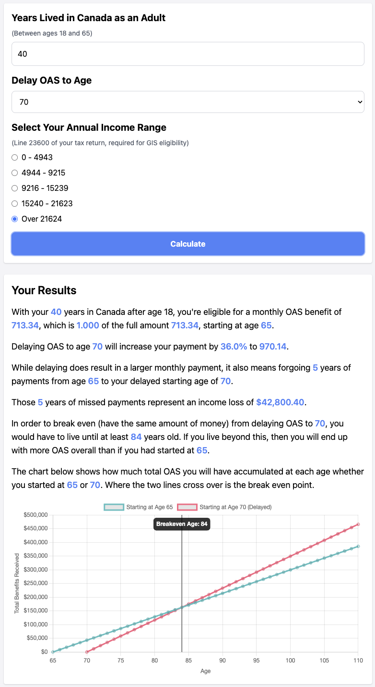

<!-- START doctoc generated TOC please keep comment here to allow auto update -->
<!-- DON'T EDIT THIS SECTION, INSTEAD RE-RUN doctoc TO UPDATE -->
**Table of Contents**  *generated with [DocToc](https://github.com/thlorenz/doctoc)*

- [OAS Delay Calculator Prototype](#oas-delay-calculator-prototype)
  - [Overview](#overview)
  - [Why is this Needed?](#why-is-this-needed)
  - [Features](#features)
  - [Screenshots](#screenshots)
  - [Current Status](#current-status)
    - [Functional Improvements](#functional-improvements)
      - [Waiting Does Not Stack: Additional Details](#waiting-does-not-stack-additional-details)
    - [Data Sourcing](#data-sourcing)
    - [Technical Enhancements](#technical-enhancements)
    - [Future Considerations](#future-considerations)
  - [Conclusion](#conclusion)
  - [Contribution](#contribution)

<!-- END doctoc generated TOC please keep comment here to allow auto update -->

# OAS Delay Calculator Prototype

## Overview

The OAS Delay Calculator is a prototype tool designed to help Canadian seniors decide whether to delay their Old Age Security (OAS) benefits. This tool calculates the breakeven age by comparing the financial benefits of taking OAS at age 65 versus delaying it up to age 70. The breakeven age is the point at which the total amount of OAS received from delaying equals the total amount received if starting at age 65.

For many people, this breakeven age is close to the average Canadian life expectancy, making it less beneficial to delay OAS. For low-income seniors eligible for the Guaranteed Income Supplement (GIS), the breakeven age can be significantly higher, sometimes reaching 90 or even 100 years. In such cases, delaying OAS can result in a financial loss.

The goal is to improve the uptake of OAS among seniors, particularly those in a low-income bracket who could also be eligible for GIS. This prototype aims to provide a clear and user-friendly interface that helps seniors understand the potential financial benefits and drawbacks of delaying their OAS payments, simplifying the decision-making process with clear visualizations and explanations.

**Note:** This is a prototype and not a finalized product. It is intended to demonstrate the concept and provide initial functionality.

## Why is this Needed?

In the Toronto Metropolitan area, where 71% of seniors are immigrants, many people turning 65 are not applying for OAS due to:

1. Attempting to attain more qualifying years for OAS.
2. Understanding that waiting until age 70 increases their monthly payments.
3. Mainstream advice from private planners advocating for delaying OAS. This advice is sound if the money is not required and there is no eligibility for GIS. However, for those eligible for significant GIS amounts, waiting might not be in their best interest.

A visual tool is needed to illustrate these nuances effectively and help low-income seniors (and their advisors if applicable) in decision making wrt OAS and GIS.

## Features

- Input forms for personal details such as income range and age.
- Calculation of the potential increase in OAS benefits when delaying.
- Visualization of the impact on GIS.
- Basic styling and structure for user interaction.

## Screenshots

**Example 1: 40 years residency, delay to 70, income too high for GIS**

**Example 2: 37 years residency, delay to 68, some GIS eligibility**

## Current Status

The current version is a working prototype with the core functionality in place. Users can input their information and see basic calculations and visualizations. However, several features and improvements are planned to make this a comprehensive and reliable tool. To evolve this prototype into a fully functional and reliable product, the following should be considered:

### Functional Improvements

In addition to the existing breakeven chart annotation, add an annotation for Statistics Canada life expectancy. Add a toggle so users can view the chart with or without this additional information. The easier way would be to use the Statistics Canada combined data for men and women. A little more work would be to also ask the user whether they are man/woman, and then show the relevant Statistics Canada life expectancy. If doing this, add explanation why we need to ask for this info.

Update styles to emphasize importance of initial years of missed payments.

Update results panel to indicate how the initial years of missed payments was calculated (eg: num years * months * OAS entitlement at age 65).

Update results panel to explain percentage increase: This is because each month of delay increases pension amt by 0.6%..

Add disclaimer panel including:
- This tool is only one piece of information of many moving parts in retirement and financial planning.
- No one can predict their exact lifespan, which adds uncertainty.
- Uncertainty in predicting future earnings and work years affects GIS calculations.
- Not considering inflation, all calculations are in today's dollars.
- The results are not financial advice and are subject to change. For a more accurate assessment of your estimated benefits amount, please visit https://www.canada.ca/en/employment-social-development/corporate/contact/oas.html

Fix awkward wording when have full 40 years: which is 1.000 of the full amount 713.34, starting at age 65.

Results panel grammar for 1 year vs multiple years.

Fix breakeven calculation to look for min diff between all points rather than hard-coded $2000 diff which may not apply for people with only a few years in Canada.

Edge case: Small number of years in Canada + GIS -> breakeven goes off the chart!

Add a section after results with some actionable advice?
* Without being morbid: "Based on your inputs, delaying OAS past age 65 is usually not beneficial as you would need to live well beyond the average life expectancy in Canada to break even. For those eligible for GIS, the age to break even is even higher."
* Add a link to Apply for OAS Now, linking to the government site. Include a `?ref=...` parameter in the URL so the government could optionally measure impact of this tool.

Ensure the tool is accessible to all users, including those with disabilities. Chart.js in particular needs some extra work: https://www.chartjs.org/docs/latest/general/accessibility.html

#### Waiting Does Not Stack: Additional Details

Add messaging that the benefits of waiting do not stack. For example:

If a person has 37 years of residency as an adult by age 65 and applies at 65, they're eligible for partial pension of 37/40th (locked in).

If this person waits until age 68 to apply, the options are:
1. Full pension (40/40ths) because now they've accumulated 40 years residency; OR
2. Default: Actuarially adjusted pension (37/40 rate x 21.6% increase….i.e., 0.6% increase for each of the 36 months they deferred)

In theory, the person could ask for the non default option (full 40/40th pension), but that's sub-optimal because the actuarially increased amount is greater.

### Data Sourcing

Currently the OAS and GIS numbers are hard-coded for 2024.

GIS in particular is difficult as it requires lookup tables for accuracy. The prototype uses a heuristic of splitting up the entire GIS income eligibility range for a single person into quartiles, then using the midpoint of those (based on which income quartile user selects).

Ideally the government of Canada would provide a free CORS enabled API for application developers to fetch OAS and GIS data but no such service exists at the time of this writing.

Given that this project will incorporate a build system (see next section on Technical Enhancements), could use this npm package: https://github.com/danielabar/gis-lookup, but that requires manual maintenance, and is only for GIS, not OAS.

Some references include:
* https://www.canada.ca/en/services/benefits/publicpensions/cpp/old-age-security/benefit-amount.html
* https://www150.statcan.gc.ca/n1/en/catalogue/84-537-X
* https://www.canada.ca/en/services/benefits/publicpensions/cpp/old-age-security/guaranteed-income-supplement/eligibility.html
* https://www.canada.ca/en/services/benefits/publicpensions/cpp/old-age-security/guaranteed-income-supplement/benefit-amount.html
* https://open.canada.ca/data/en/dataset/dfa4daf1-669e-4514-82cd-982f27707ed0

### Technical Enhancements

Refactor and optimize the existing codebase for better performance and maintainability. This may include selection of a JavaScript SPA such as Svelte, together with Vite.

Implement comprehensive unit and integration tests to ensure accuracy and reliability.

Variable naming should include whether the given value is monthly or annual.

Ensure all user data is handled securely and in compliance with relevant data protection regulations - only an issue if add a server-side backend to persist data, but most likely this will be a static client-side only app.

Provide detailed documentation for both users and developers, including setup instructions, usage guides, and contribution guidelines.

### Future Considerations

- **Localization:** Support multiple languages to cater to a broader audience.
- **Mobile Optimization:** Ensure the tool is fully functional and user-friendly on mobile devices.
- **Analytics:** Implement analytics to track user interactions and gather feedback for further improvements.

## Conclusion

The OAS Delay Calculator Prototype is an initial step towards creating a helpful tool for Canadian seniors, particularly those that are low income and immigrants without a full 40 years of residency. While the prototype demonstrates the core idea and functionality, there are several enhancements and features needed to make it a fully-fledged product. By addressing the initiatives listed above, we aim to build a reliable, user-friendly, and valuable tool for those considering their OAS options.

## Contribution

Contributions are welcome! If you have any suggestions or would like to help with development, please feel free to open an issue or submit a pull request.
